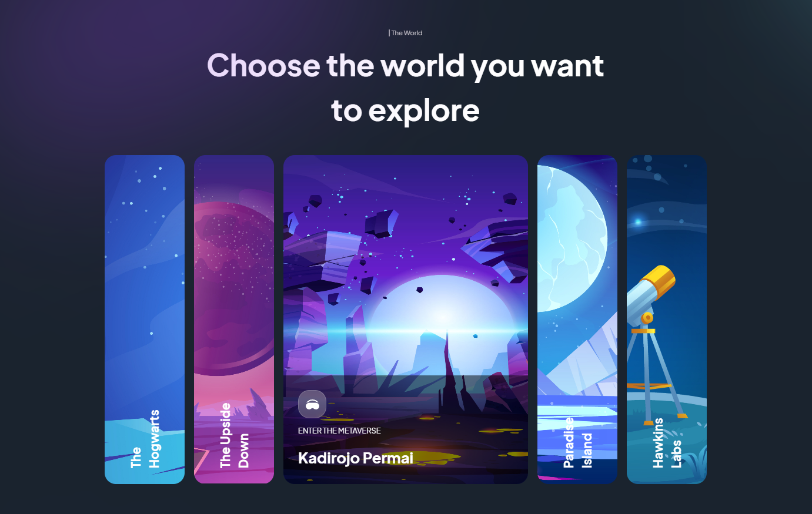

# Modern Animated Website
This is a moderna animated website with a theme around virtual reality built using NextJS animated using Framer Motion and styled using Tailwind CSS. The site features navbar, hero section, interactive worlds preview, customer reviews, news reel and interactive footer sections.


## Features

- NextJS
- Reusable components
- Framer Motion
- TailwindCSS styling
- Tailwind themes
- Mobile responsive


## Demo


## Installation

Install this modern animated site with npm

```bash
  cd starter_repo
  npm install
  npm run dev
```
    
## Screenshots




## Tech Stack

**Client:** NextJS, HTML, JavaScript, Framer Motion, TailwindCSS


## License

[MIT](https://choosealicense.com/licenses/mit/)


## 🔗 Links
[](https://www.linkedin.com/in/thomas-turner-university-of-leeds-crystallisation/)

[Tom Turner Portfolio](https://tomturnerdeveloper.vercel.app/)


## Acknowledgements

 - See the excellent JavaScript Mastery for full tutorial for this project
 - https://www.youtube.com/watch?v=B91wc5dCEBA&t=133s
 - https://github.com/adrianhajdin
 

 


## Authors

- [Tom Turner](https://www.github.com/tdt13)

